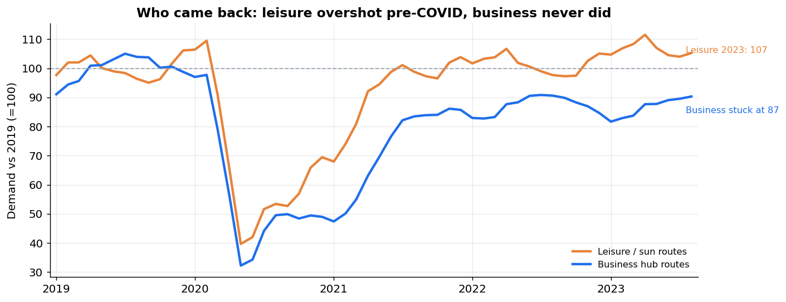
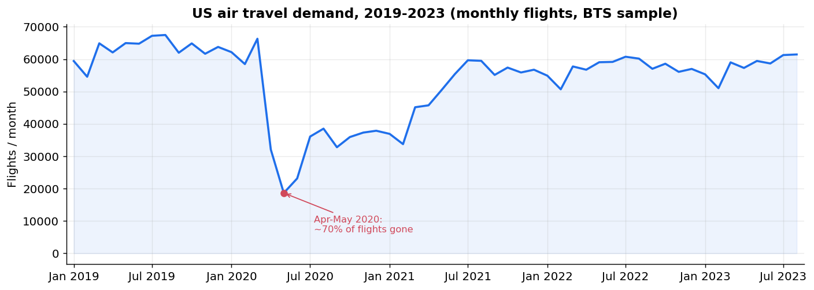
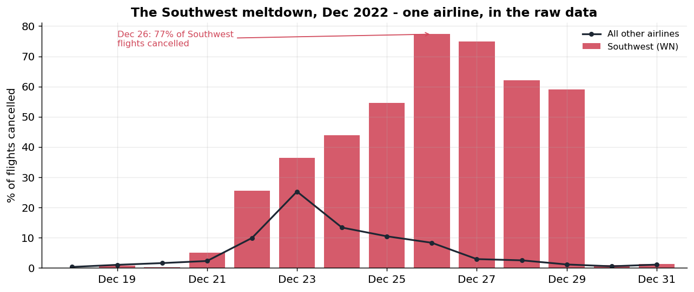
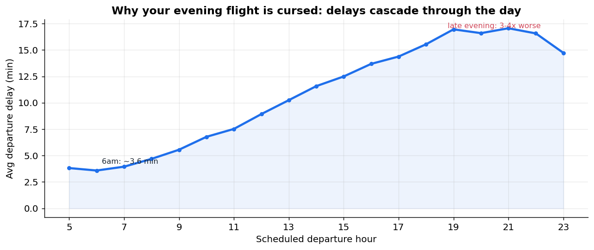

# US Air Travel 2019-2023: What the Recovery Actually Looked Like

An analysis of roughly 3,000,000 real US flights (BTS on-time records, 2019-2023):
how air-travel demand collapsed during COVID, which segments came back, and where
the system still breaks down. The heavy aggregation runs in SQL on DuckDB; the
statistics and charts are done in Python.

> **Data:** U.S. DOT Bureau of Transportation Statistics, "Reporting Carrier
> On-Time Performance" - a 3M-row public sample covering January 2019 to August
> 2023. These are real flights operated by US carriers, with delay-cause
> breakdowns and cancellations included. The CSV is about 600 MB and is not
> committed here; download it from BTS or Kaggle and place it in `av_data/`.

## Findings

### 1. Business travel never came back; leisure overshot



Both segments crashed together in spring 2020, each down about 70%. The recovery
then split. By 2023, leisure and sun routes were running 7% above their 2019 level,
while business-hub routes plateaued near 87% and stopped climbing. So "air travel
recovered" is only partly accurate: leisure recovered, but business trips were
structurally replaced by video calls and never fully returned. That distinction
matters for anyone planning capacity or pricing, because the growth is concentrated
in one segment.

### 2. The COVID demand cliff



The monthly series puts a number on the collapse: demand bottomed out in
April-May 2020 at roughly 30% of normal, then recovered over the next three years
in the uneven way shown above.

### 3. The Southwest meltdown, visible in the raw data



A winter storm hit every airline around December 22-23, 2022, but only one of them
collapsed. Southwest's cancellation rate climbed day after day, reaching 77% on
December 26, while every other carrier was already back under 10%. The data makes
clear this wasn't really about the weather, which had passed; it was one airline's
operations failing. A single `WHERE carrier='WN'` is enough to see it.

### 4. Why your evening flight runs late: delays cascade



Average departure delay grows from about 3.6 minutes at 6am to roughly 16.6 minutes
by 8pm. The cause breakdown explains the mechanism: "late-aircraft" delay (the
previous flight on that plane ran late) is 23% of delay minutes in the morning but
45% in the evening. Delay isn't random; it builds up over the course of the day as
aircraft fall behind schedule. If you can, book early.

## Method

- DuckDB runs SQL directly over the 600 MB CSV (aggregation, `CASE`-based
  segmentation, date math, cancellation rates), so there's no need to load the whole
  file into pandas first.
- Recovery is indexed to each segment's own 2019 monthly baseline, so normal
  seasonality isn't mistaken for recovery.
- Delay causes use the BTS minute-allocation fields: carrier, weather, NAS,
  security, and late-aircraft.

## What these questions are good for

These are the same questions a demand or market-intelligence team works through on
real ticketing data: which segments are growing, where demand has shifted, and which
operational risks concentrate in a single carrier or time of day. This dataset has no
fares, so it's a demand-and-reliability study rather than a pricing one. Adding fare
data (DOT DB1B) would extend it toward elasticity and revenue management.

## Reproduce

```bash
pip install -r requirements.txt
# place flights_sample_3m.csv in av_data/
python analysis.py     # writes charts/
```

## Limitations

US carriers only. It's a 3M-row sample, so rates are reliable but absolute counts are
sample-scaled. The business/leisure split is a destination proxy, not a surveyed trip
purpose. The data ends in August 2023.

*Tools: DuckDB, SQL (CTEs, window functions, CASE aggregation), Python (pandas,
numpy, matplotlib). Data: U.S. BTS.*
